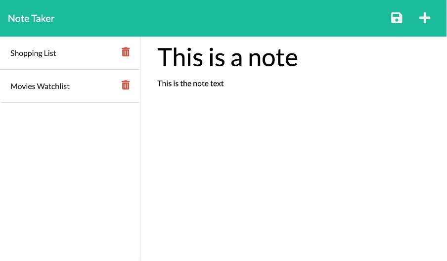

# Week 11 Challenge - Note Taker Application

Live link:

## Task Description

This week our task was to create a backend server.js file using express that would allow the user to access/add/delete notes. This was done via three different API methods; GET, POST, and DELETE.

## Image of Working Application

